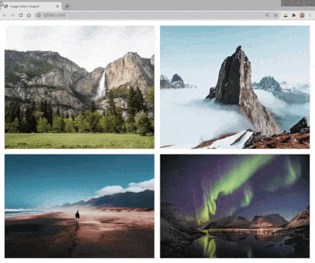

# :sparkles: ​Fluid Image Popup

Simple HTML component of a pop-up animation when selecting an image from a grid.

- Youtube Tutorial: [Link](https://www.youtube.com/watch?v=4SQXOA8Z-lo)
- My Take on the Tutorial: [Link](https://neuhaus93.github.io/fluid-imagem-popup)

<h6 align="center"></h6>

<em>Exemplo do componente</em>

## :mailbox_with_mail: Get in touch!

    
    
    
    

---

Made with :coffee: and ❤️ by Lucas Neuhaus.

